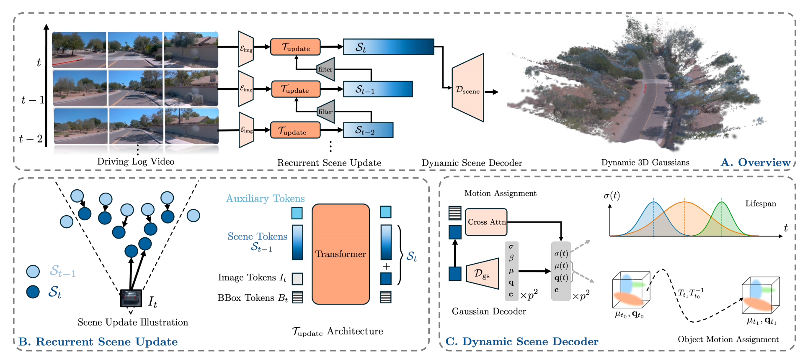

<div align="center">
<h3> [🎉CVPR 2026!] UFO: Unifying Feed-Forward and Optimization-based Methods for Large Driving Scene Modeling</h3>

Kaiyuan Tan<sup>1,2,\*</sup>, Yingying Shen<sup>1,*</sup>, Ziyue Zhu<sup>1</sup>, Mingfei Tu<sup>1</sup>, Haohui Zhu<sup>1</sup>, Bing Wang<sup>1</sup>, Guang Chen<sup>1</sup>, Hangjun Ye<sup>1,✉</sup>, Haiyang Sun<sup>1,†</sup>

<sup>1</sup>  Xiaomi EV
<sup>2</sup>  UIUC

(\*) Equal contribution. (†) Project leader. (✉)Corresponding Author.

<!-- 等arxiv的地址 -->
<a href="https://arxiv.org/abs/2602.20943"></a>
<a href="https://wm-research.github.io/UFO/"></a>
</div>


<!-- ## Introduction -->
## Abstract
Dynamic driving scene reconstruction is critical for autonomous driving simulation and closed-loop learning. While recent feed-forward methods have shown promise for 3D reconstruction, they struggle with long-range driving sequences due to quadratic complexity in sequence length and challenges in modeling dynamic objects over extended durations. We propose UFO, a novel recurrent paradigm that combines the benefits of optimization-based and feed-forward methods for efficient long-range 4D reconstruction.Our approach maintains a 4D scene representation that is iteratively refined as new observations arrive, using a visibility-based filtering mechanism to select informative scene tokens and enable efficient processing of long sequences. For dynamic objects, we introduce an object pose-guided modeling approach that supports accurate long-range motion capture. Experiments on the Waymo Open Dataset demonstrate that our method significantly outperforms both per-scene optimization and existing feedforward methods across various sequence lengths. Notably, our approach can reconstruct 16-second driving logs within 0.5 second while maintaining superior visual quality and geometric accuracy.
## Overview
<div align="center">

</div>

## News
`[2026/02/21]` UFO is accepted by CVPR 2026🎉🎉🎉!

## Updates
- [x] Release Paper   
- [ ] Release Full Models  
- [ ] Release Inference Framework 
- [ ] Release Training Framework 


## Citation
If you find UFO is useful in your research or applications, please consider giving us a star 🌟 and citing it by the following BibTeX entry.

```bibtex
@misc{tan2026ufounifyingfeedforwardoptimizationbased,
      title={UFO: Unifying Feed-Forward and Optimization-based Methods for Large Driving Scene Modeling}, 
      author={Kaiyuan Tan and Yingying Shen and Mingfei Tu and Haohui Zhu and Bing Wang and Guang Chen and Hangjun Ye and Haiyang Sun},
      year={2026},
      eprint={2602.20943},
      archivePrefix={arXiv},
      primaryClass={cs.CV},
      url={https://arxiv.org/abs/2602.20943}, 
}
```